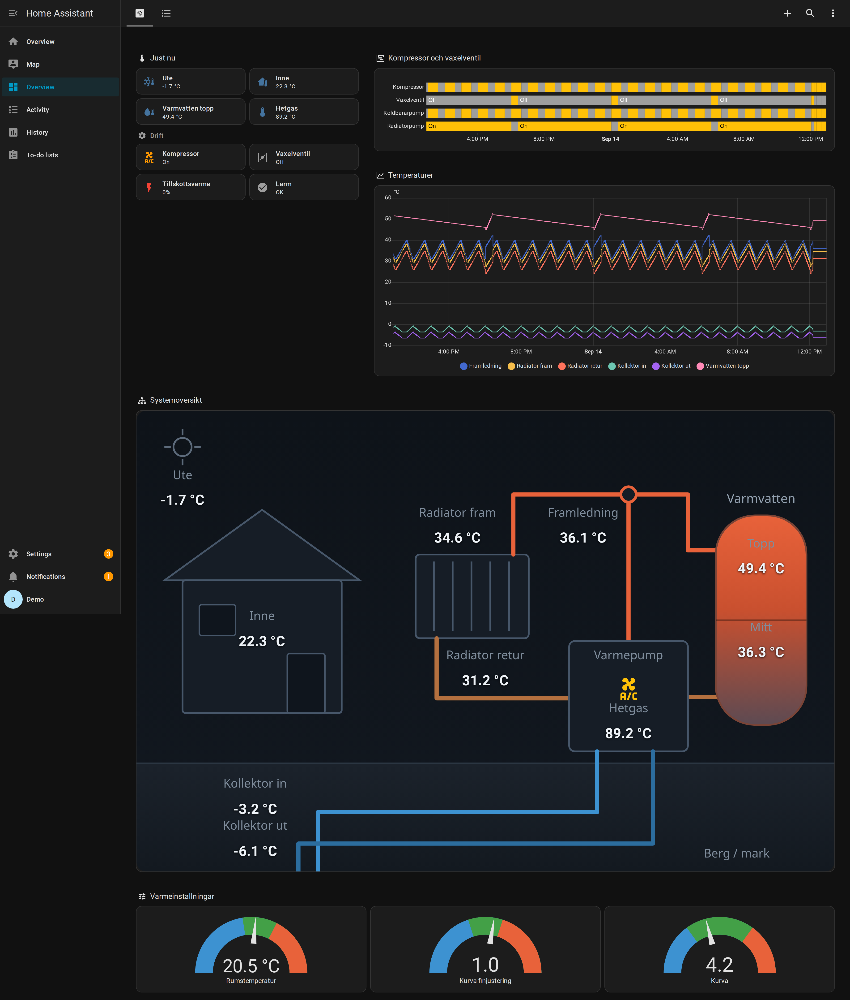
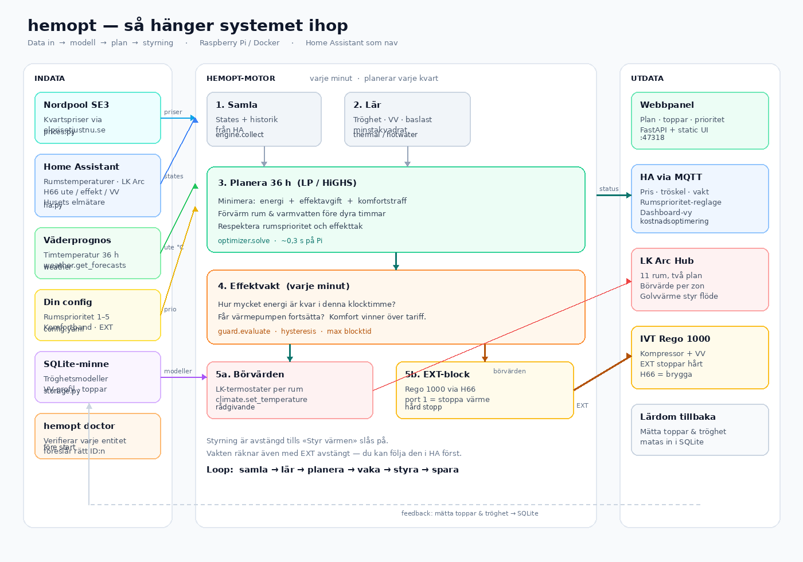

# Husdata H66 – dashboard för Home Assistant

En Home Assistant-dashboard för en värmepump som läses av med en
[Husdata H60/H66 WiFi Gateway](https://husdata.se/produkt/h66-wifi-gateway/).

Den innehåller tre delar, som alla går att använda var för sig:

| Fil | Vad den gör |
| --- | --- |
| `packages/husdata_h66.yaml` | Skapar alla entiteter från H66:ns MQTT-topics |
| `dashboards/heatpump.yaml` | Själva dashboarden |
| `dashboards/heatpump-h66-discovery.yaml` | Dashboard för H66 auto-discovery med `h66_`-prefix |
| `dashboards/kostnadsoptimering.yaml` | Vy för optimeringstjänsten |
| `www/husdata/heatpump-schematic.svg` | Schematiken som värdena läggs ovanpå |
| `hemopt/` | Home Assistant-tillägg som flyttar last och kapar effekttoppar |



## Vad dashboarden visar

**Översikt**

- Brickor med ute, inne, varmvatten och hetgas, plus drift­status för kompressor,
  växelventil och tillskottsvärme.
- Tidslinje över kompressor, växelventil och cirkulationspumpar senaste dygnet.
- Temperaturgraf med framledning, radiatorkrets, kollektor och varmvatten.
- En schematisk systembild med mätvärdena utplacerade på hus, radiator,
  värmepump, beredare och kollektor.
- Mätare för rumstemperatur, värmekurva och kurvans finjustering.
- Ett larmkort som bara dyker upp när pumpen larmar.

**Alla värden** listar samtliga register som tabeller.

**Golvvärme nere** och **Golvvärme uppe** visar LK ArcSense-givarna grupperade
efter ArcHub/fördelare. Varje rum visar temperatur, luftfuktighet och batteri,
plus en gemensam temperaturgraf för våningen. Vyerna använder entitets-ID:n som
skapats av community-integrationen `angoyd/ha-lksystems`.

**Kostnadsoptimering** visar spotpris, planerad effekt, månadens effekttoppar
och en prioritetsreglage per rum. Vyn kräver att tillägget i `hemopt/` körs.

## Kostnadsoptimering

`hemopt/` är ett Home Assistant-tillägg som flyttar uppvärmning och varmvatten
till billiga timmar och håller nere effektavgiften. Det läser rumstemperaturerna
från Home Assistant, hämtar Nordpools kvartspriser, lär sig husets tröghet och
varmvattenvanor, och skriver tillbaka börvärden till termostaterna.



### Installera i Home Assistant

Repot är samtidigt en add-on-databas, så installationen är fyra klick och
uppdateringar kommer sedan som en knapp:

**Settings → Add-ons → Add-on Store →** trepunktsmenyn **→ Repositories →**
klistra in repots URL **→ Add**, och installera **Kostnadsoptimering (hemopt)**.

Ingen token och inget MQTT-lösenord behövs: Supervisorn ger tillägget båda.
Se [`hemopt/DOCS.md`](hemopt/DOCS.md) för hela gången.

### Köra lokalt i stället

```bash
cd hemopt
uv sync
uv run hemopt --demo serve --port 47318
```

Demoläget kör den riktiga optimeraren mot verkliga SE3-priser men ett simulerat
hus, så du kan titta på den innan något kopplas in.

För skarp drift utanför Home Assistant finns `hemopt/config.exempel.yaml`
ifylld för det här huset, med H66-entiteterna och alla elva LK Arc-rum. Kopiera
den till `config.yaml`, fyll i token, och låt

```bash
uv run hemopt -c config.yaml doctor
```

kontrollera varje entitet mot din Home Assistant. Den föreslår rättningar för
dem som inte stämmer, vilket är det enda praktiska sättet att få rätt på de
entitets-ID:n som genereras ur enhetsnamn.

Se [`hemopt/README.md`](hemopt/README.md) för effektavgiftsmodellen,
effektvakten som styr via EXT-kabeln, och hur tjänsten körs på en Raspberry Pi.

## Installation

### 1. Koppla H66 till Home Assistant över MQTT

Installera **Mosquitto broker** som add-on i Home Assistant och lägg upp ett
eget konto för MQTT (till exempel `mqtt_user`).

Ställ sedan in H66 under **Config**:

```
MQTT_SRVR   = IP-adressen till Home Assistant
MQTT_PORT   = 1883
MQTT_USER   = mqtt_user
MQTT_PASS   = ditt lösenord
MQTT_PUBALL = 20
MQTT_DISCOV = 0
MQTT_SUBS   = 0
```

Starta om H66 och kontrollera dess **Log**. Står det
`MQTT Connected with user/pass` är anslutningen uppe.

### 2. Skapa entiteterna

Kopiera `packages/husdata_h66.yaml` till `config/packages/` och se till att
`configuration.yaml` läser in mappen:

```yaml
homeassistant:
  packages: !include_dir_named packages
```

Starta om Home Assistant. Du ska nu ha entiteter som `sensor.hp_outdoor`,
`sensor.hp_warm_water_top` och `binary_sensor.hp_compressor`.

> **Använder du hellre auto-discovery?** Sätt `MQTT_DISCOV = 1` i H66 i stället
> och hoppa över paketfilen. Då heter entiteterna något annat, och du behöver
> byta ut namnen i dashboarden. Kör inte båda samtidigt – då får du dubbletter.

### 3. Lägg in schematiken

Kopiera `www/husdata/heatpump-schematic.svg` till `config/www/husdata/` så att
den nås på `/local/husdata/heatpump-schematic.svg`. Mappen `config/www/`
serveras statiskt av Home Assistant, men först efter en omstart.

### 4. Lägg till dashboarden

Gå till **Inställningar → Dashboards → Lägg till dashboard → Ny dashboard från
grunden**, öppna den, välj **Redigera** → tre prickar → **Råkonfigurationsredigerare**
och klistra in innehållet i `dashboards/heatpump.yaml`.

Vill du hellre ha den i YAML-läge, lägg den under `config/` och peka ut den:

```yaml
lovelace:
  dashboards:
    varmepump:
      mode: yaml
      filename: dashboards/heatpump.yaml
      title: Värmepump
      icon: mdi:heat-pump
      show_in_sidebar: true
```

Schematiken är ritad för **mörkt tema**.

## Registren som används

H66 publicerar varje register på `<mac>/HP/<IDX>`. Paketet prenumererar med
wildcard, `+/HP/0001`, så du slipper skriva in MAC-adressen.

| IDX | Entitet | Beskrivning |
| --- | --- | --- |
| 0001 | `sensor.hp_radiator_return` | Radiator retur |
| 0002 | `sensor.hp_radiator_forward` | Radiator fram |
| 0003 | `sensor.hp_heat_carrier_return` | Värmebärare retur |
| 0004 | `sensor.hp_heat_carrier_forward` | Värmebärare fram |
| 0005 | `sensor.hp_brine_in` | Kollektor in / förångare |
| 0006 | `sensor.hp_brine_out` | Kollektor ut / kondensor |
| 0007 | `sensor.hp_outdoor` | Utetemperatur |
| 0008 | `sensor.hp_indoor` | Innetemperatur |
| 0009 | `sensor.hp_warm_water_top` | Varmvatten topp |
| 000A | `sensor.hp_warm_water_mid` | Varmvatten mitt |
| 000B | `sensor.hp_hot_gas` | Hetgas |
| 0107 | `sensor.hp_heating_setpoint` | Börvärde värme |
| 0111 | `sensor.hp_warm_water_setpoint` | Börvärde varmvatten |
| 0203 | `sensor.hp_room_temp_target` | Rumstemperatur börvärde |
| 0207 | `sensor.hp_curve_fine` | Kurva, finjustering |
| 2205 | `sensor.hp_curve` | Värmekurva |
| 3104 | `sensor.hp_add_heat` | Tillskottsvärme |
| 1A01 | `binary_sensor.hp_compressor` | Kompressor |
| 1A02 / 1A03 | `binary_sensor.hp_add_heat_step_1` / `_2` | Tillskott steg 1 och 2 |
| 1A04 | `binary_sensor.hp_brine_pump` | Köldbärarpump |
| 1A05 | `binary_sensor.hp_heat_carrier_pump` | Värmebärarpump |
| 1A06 | `binary_sensor.hp_radiator_pump` | Radiatorpump |
| 1A07 | `binary_sensor.hp_switch_valve` | Växelventil |
| 1A20 | `binary_sensor.hp_alarm` | Larm |

Alla värmepumpar har inte alla register. H66:ns startsida listar vilka IDX just
din modell rapporterar – ta bort resten ur paketfilen och dashboarden.

## Ändra inställningar från Home Assistant

Som standard är allt skrivskyddat. Vill du kunna ändra rumstemperatur och
värmekurva från Home Assistant:

1. Sätt `MQTT_SUBS = 1` i H66 och starta om den.
2. Avkommentera `number`-blocket längst ner i `packages/husdata_h66.yaml` och
   skriv in H66:ns MAC-adress i `command_topic` (SET-topicen kan inte använda
   wildcard).
3. Ta bort motsvarande sensorer i samma fil, annars krockar entitetsnamnen.
4. Byt `sensor.hp_room_temp_target`, `sensor.hp_curve` och
   `sensor.hp_curve_fine` mot `number.*` i mätarna i dashboarden.

## Styra EXT-kabeln

Den auto-discovery-anpassade dashboarden har kontroller för H66-register
`12FA` och `12FB`:

- `climate.h66_hpext_control_port_1`
- `climate.h66_hpext_control_port_2`

H66 representerar 0/1-reglagen som climate-entiteter. Dashboardens knappar
anropar `climate.set_temperature` med `1` för att aktivera EXT-signalen och `0`
för att frisläppa den. Aktiveringsknapparna kräver bekräftelse.

Sätt `EXP_PORT = EXT` och `MQTT_SUBS = 1` i H66. Koppla och konfigurera sedan
respektive EXT-ingång enligt värmepumpens manual. En aktiv signal kan stoppa
kompressor, varmvatten eller eltillskott omedelbart. Testa därför en port i
taget och kontrollera alltid att `0` verkligen frisläpper den igen.

Registren `2233` och `2234` (`External control`) är pumpens egna externa
styrvariabler. De är inte samma sak som EXT-kabelns H66-utgångar `12FA` och
`12FB`.

### Rego 1000 CAN-rumsregulator

Den här funktionen ska bara användas när ingen fysisk IVT CAN-rumsgivare är
ansluten. Finns en fysisk givare, sätt `ROOM_CTRL = 0` och låt den ensam
rapportera rumstemperaturen till Rego.

H66 kan emulera en CAN-rumsregulator för värmekrets 1. Sätt `ROOM_CTRL = 1`
och starta om H66. Använd inte emuleringen om en fysisk CAN-rumsgivare redan är
ansluten, och använd den bara på system med en värmekrets.

Dashboarden visar:

- `climate.h66_hproom_controller` – aktuell temperatur som H66 skickar till
  Rego var sjätte sekund (H66-register `02F1`)
- `climate.h66_hproom_temp_setpoint` – önskat rumsvärde (`0203`)
- `climate.h66_hproom_sensor_influence` – rumsgivarens påverkan (`2204`)

För automatisk uppdatering av den emulerade temperaturen behöver en automation
kopiera värdet från en verklig rumsgivare i Home Assistant till
`climate.h66_hproom_controller`. Använd inte `sensor.h66_hpindoor` som källa,
eftersom det är värdet som kommer tillbaka från pumpen och skulle skapa en
återkopplingsloop.

## Köra demon lokalt

Mappen `demo/` startar en Home Assistant med påhittade värden, så du kan se
dashboarden utan att ha en värmepump inkopplad. Det kräver Python 3.13.

```bash
uv venv --python 3.13 && uv pip install homeassistant

mkdir -p config/www/husdata
cp demo/configuration.yaml demo/demo_entities.yaml config/
cp dashboards/heatpump.yaml config/ui-lovelace.yaml
cp www/husdata/heatpump-schematic.svg config/www/husdata/

.venv/bin/hass -c config
```

Öppna sedan http://127.0.0.1:48213 och skapa ett konto. Välj mörkt tema under
din profil.

## Felsökning

**Värdena är tio gånger för stora** – H66 publicerar råvärden på MQTT. Lägg till
`value_template: "{{ value | float / 10 }}"` på de sensorer det gäller.

**Entiteterna blir `unknown`** – H66 skickar bara när ett värde ändras. Sätt
`MQTT_PUBALL = 20` så publiceras allt om igen var tjugonde minut, eller skicka
`GETALL` på `<mac>/HP/CMD`.

**Schematiken visas inte** – filen måste ligga i `config/www/husdata/` och
Home Assistant måste ha startats om efter att du skapade mappen.

**Korten säger "Entity not found"** – dina entiteter heter något annat. Slå upp
rätt namn i **Utvecklarverktyg → Tillstånd** och byt ut dem i dashboarden.
